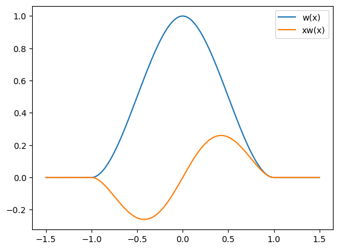

# 課題解決型実習

## サププロジェクト　シェーダープログラミング

2023/07/11

Shimizu Tetsuya

---

# 今回のテーマ「勾配ノイズ」

- 値ノイズ
  - 計算量が少なく簡単につくることができる
  - ムラが出やすい傾向がある
- 勾配ノイズ
  - 乱数のベクトル値を「勾配」として扱う
  - ここで紹介する勾配ノイズ
    - 2002 年に Perlin が発表した「[改良版勾配ノイズ（Perlin ノイズ）](https://mrl.cs.nyu.edu/~perlin/paper445.pdf)」

---

# 勾配ノイズの構成法（１）

値ノイズは乱数値をエルミート補間してノイズを構成していた

エルミート補間関数 $h(x)$ について考える

今考えるエルミート補間関数の特徴は以下の通りである

$h(0)=0, h(1)=1, h'(0)=h'(1)=0$

$h(0)=0, h(1)=1$ はそのままである

$h'(0) = h'(1) = 0$ は微分したらゼロなのでつまり$h(0),h(1)$点での接線の傾きがゼロという意味になる

---

# 勾配ノイズの構成法（２）

先程のエルミート補間関数をイメージは以下のようになる．

---

# 勾配ノイズの構成法（３）

このエルミート補間関数に対して以下のような関数を定義する．

$$
  w(x)=
  \begin{cases}
    h(x + 1) & (-1 \leq x < 0) \\
    1 - h(x) & (0 \leq x < 1) \\
    0        & (x < -1, 1 < x)
  \end{cases}
$$

この関数　$w(x)$ は，$[-1,1]$の区間でのみ$0$以外の値を取り，区間外では，$0$となることがわかる．このような関数を **窓関数** と呼ぶ．

---

# 勾配ノイズの構成法（４）

$w(x)$のグラフを以下に示す．

